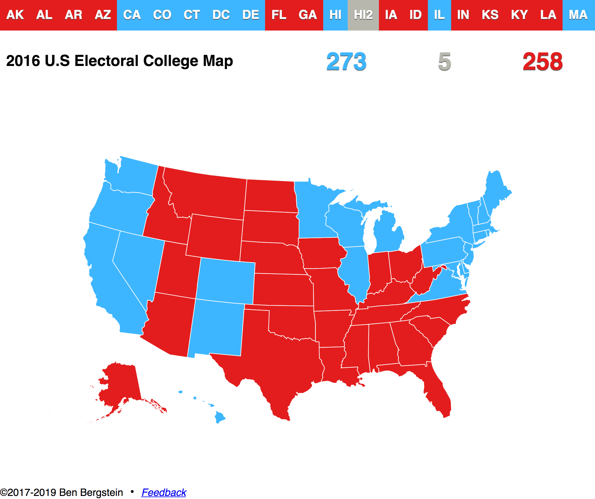

# US Electoral Map

Simple, interactive map using D3 and Datamaps to see who wins the presidency with any subset of US states.

Live version is running on github pages: [benjaminbergstein.github.io/us-electoral-map](http://benjaminbergstein.github.io/us-electoral-map)



# Prerequisites

- [Install Docker](https://www.docker.com/get-started)

# Run the app

```
make develop
```

# Re-build the app

```
make build
```

# Feedback

Feedback is welcome! Please fill out [this form](https://goo.gl/forms/THky9dqIPI9AezJb2) to send in your feedback.

If there is a bug or problem, please open an issue [here on Github](https://github.com/benastan/us-electoral-map/issues).
 
