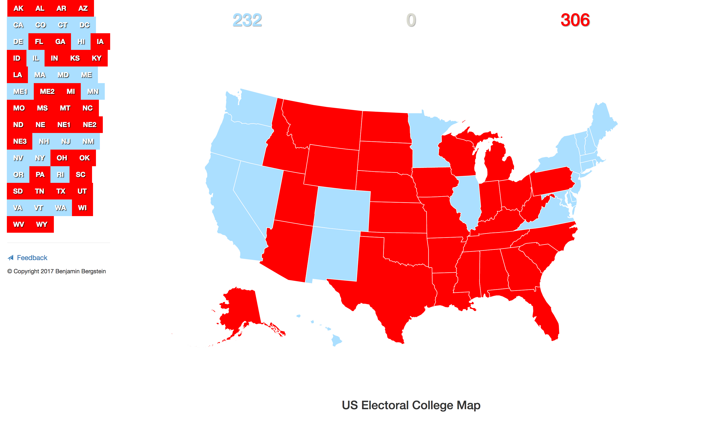

# US Electoral Map

Simple, interactive map using D3 and Datamaps to see who wins the presidency with any subset of US states.

Live version is running on github pages: [benastan.github.io/us-electoral-map](http://benastan.github.io/us-electoral-map)



# Run the app

You will need some version of ruby installed, [click here](https://www.ruby-lang.org/en/documentation/installation/) to read Ruby's installation guide.

Add `./scripts` to your path, then run:

```
server
```

Or just:

```
./scripts/server
```

You should see something like:

```
INFO  WEBrick 1.3.1
INFO  ruby 2.3.1 (2016-04-26) [x86_64-darwin15]
INFO  WEBrick::HTTPServer#start: pid=55036 port=8080
```

Now open a web browser and navigate to http://localhost:8080.

# Build index.html

Again, you will need ruby installed, and also bundler. See [bundler.io](http://bundler.io/) for installation information.

Once you've got bundler run:

```
bundle
```

Now you can use the `build` script:

```
build
```

Or if you don't have `./scripts` in your path:

`./scripts/build`

_HINT:_ While developing, use the following command to build every second to keep your index.html up to date:
 
 ```
 watch -n1 build
 ```

# Feedback

Feedback is welcome! Please fill out [this form](https://goo.gl/forms/THky9dqIPI9AezJb2) to send in your feedback.

If there is a bug or problem, please open an issue [here on Github](https://github.com/benastan/us-electoral-map/issues).
 